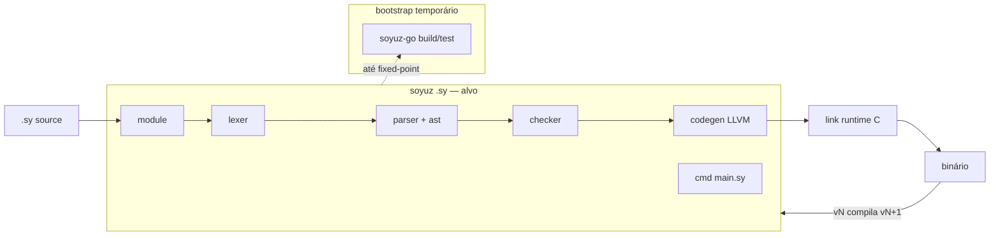

# Self-hosting completo (Nível 3)

Plano broadstrokes para o compilador Soyuz compilar a si mesmo **sem** passar pelos níveis intermediários (binário bootstrap via fixes de codegen Go, ou integração híbrida `--frontend=sy`).

## Contexto

| Repositório | Papel |
|-------------|-------|
| [`soyuz`](/home/vand/Projects/soyuz) | Compilador self-hosted (frontend **concluído** M0–M26) |
| [`soyuz-go`](/home/vand/Projects/soyuz-go) | Compilador bootstrap (Go) — usado para type-check e compilação incremental até fixed-point |

**Pré-requisito concluído:** lexer, parser, checker (~6500 LOC, milestones M0–M26). Ver [`INTEGRATION.md`](INTEGRATION.md) e [`.cursor/plans/migração_ast_checker_e8bf0647.plan.md`](../.cursor/plans/migração_ast_checker_e8bf0647.plan.md).

**Escopo deste plano:** portar backend (codegen LLVM, module, runtime, stdlib, CLI) diretamente para Soyuz.

## Arquitetura alvo



## Bootstrap (sem Nível 1/2)

- **Não** estabilizar binário Go do frontend existente como milestone dedicado.
- **Não** implementar `--frontend=sy` / tradutor AST.
- **Sim** usar `soyuz-go` como bootstrap durante o port: type-check (`type=library`) + compilar módulos novos incrementalmente.
- Fixes pontuais em `soyuz-go/internal/codegen/` são permitidos **dentro** de um milestone quando bloquearem compilação de um módulo recém-portado — não como fase separada.
- **Fixed-point final (S12):** binário `soyuz` (Soyuz) compila o repositório `soyuz` e produz binário equivalente.

## Milestones

Status: `pending` | `in_progress` | `done`

| ID | Milestone | Referência Go | Entregável Soyuz | Critério de pronto | Status |
|----|-----------|---------------|------------------|-------------------|--------|
| **S0** | Scaffolding codegen | `internal/codegen/generator.go` (tipos, `Generator` struct) | `src/codegen/` — pacote, `Generator` shell, tipos auxiliares (`structInfo`, `enumInfo`, …) | Type-check OK; `soyuz build` (library) inclui pacote | `done` |
| **S1** | Tipos LLVM | `gen_types.go` | `src/codegen/gen_types.sy` — mapeamento checker→LLVM, constantes, records vazios | Testes portados de `ir_check_test.go` (subset) passam via bootstrap | `done` |
| **S2** | Expressões e literais | `gen_exprs.go` | `src/codegen/gen_exprs.sy` — aritmética, calls, index, string/char | Testes M0–M2 codegen baseline passam | `done` |
| **S3** | Funções e controle | `gen_funcs.go`, `gen_control.go` | `gen_funcs.sy`, `gen_control.sy` — fn decl, if/while/for, return, break/continue | Testes control flow + `loop_value_test.go` passam | `done` |
| **S4** | Structs, enums, patterns | `gen_structs.go`, `gen_patterns.go` | `gen_structs.sy`, `gen_patterns.sy` — ADTs, match, when guards | Testes `m6_enum_test.go`, `when_guard_test.go`, `when_dispatch_test.go` passam | `done` |
| **S5** | Collections e iteradores | `gen_collections.go`, `gen_iter.go` | `gen_collections.sy`, `gen_iter.sy` — List, Map, for-in | Testes `m3_collections_test.go`, `m7_for_in_test.go` passam | `done` |
| **S6** | Classes e interfaces | `gen_structs.go` (classes), `m5_class_test.go` | Extensões em `gen_structs.sy` — classes, vtables, extend | Testes `m5_class_test.go`, `interface_return_test.go` passam | `done` |
| **S7** | Async e concorrência | `gen_channel.go`, `gen_sync.go`, `gen_arc.go`, `gen_gather.go` | Módulos correspondentes em `src/codegen/` | Testes M9–M26 (channel, sync, arc, task, gather) passam | `done` |
| **S8** | Module system | `internal/module/*.go` | `src/module/` — `soyuz.toml`, resolver, graph, prelude | Imports `@pkg/path` resolvem; testes `module_test.go` portados | `done` |
| **S9** | Runtime e link | `internal/runtime/embed.go`, `src/*.c` | `src/runtime/` — FFI/embed, driver de link (clang) | `soyuz run` executa hello-world mínimo | `done` |
| **S10** | Stdlib | `std/lib/*.sy` | `std/` — prelude, collections, string, os, fs, async, error, path | Checker resolve prelude; programas de `feature-tests/` compilam | `done` |
| **S11** | CLI driver | `cmd/main.go` | `main.sy` — `build`, `run`, `test`, `new` | `soyuz test test_runner.sy` roda lexer+parser+checker+codegen | `done` |
| **S12** | Fixed-point bootstrap | `internal/compile/*_test.go` | Script `tools/bootstrap-verify.sh` | vN e vN+1 produzem IR/binário equivalente; Go dispensável | `in_progress` |

### Ordem sugerida

S0 → S1 → S2 → S3 → S4 → S5 → S6 → S7 → S8 → S9 → S10 → S11 → S12

S8 pode começar em paralelo após S2 (imports não bloqueiam exprs). S10 depende de S8+S9.

### Escopo por invocação (`/migrate-compiler`)

Cada ciclo implementa **uma fatia** do milestone `in_progress` ou inicia o próximo `pending`:

- Ex.: S2 fatia 1 = literais numéricos + binops; fatia 2 = calls; fatia 3 = index/string.
- Atualizar coluna **Status** deste MD ao concluir milestone inteiro.
- Não avançar de milestone com critério de pronto não satisfeito.

## Referências

| Área | Caminho soyuz-go |
|------|------------------|
| Codegen | `internal/codegen/` (~54 arquivos) |
| Runtime C | `internal/runtime/src/*.c`, `embed.go` |
| Module | `internal/module/` |
| Stdlib | `std/lib/*.sy` |
| Pipeline | `cmd/main.go` |
| Feature tests | `feature-tests/*.sy` |
| Design docs | `soyuz-docs/src/content/docs/internals/` |

## Comandos úteis

```bash
# Estado geral
bash tools/migrate-status.sh

# Type-check frontend + codegen (library mode)
soyuz build   # entry=validate.sy, type=library

# Testes runtime (expandir conforme milestones)
soyuz test test_runner.sy
```

## Conclusão

Self-hosting completo quando **S12** estiver `done`: o binário produzido pelo repositório `soyuz` compila o repositório `soyuz` sem `soyuz-go`.
